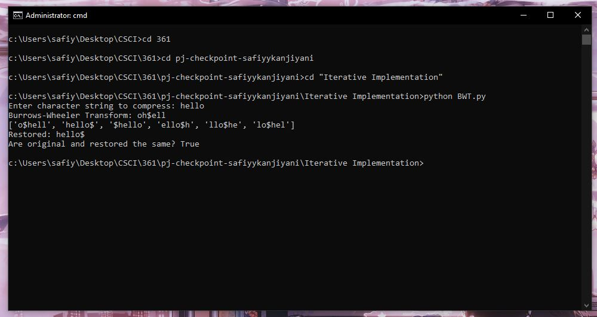
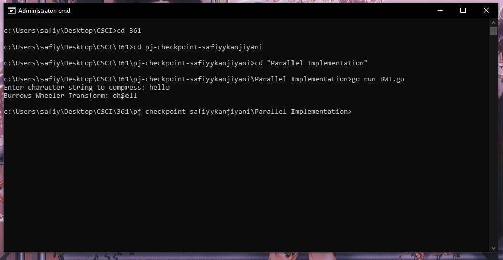

I've written an iterative implementation of the BWT in python which can be run by ```python BWT.py```.


Basically, the iterative steps of creating a BWT matrix are:
1. create an array of length of the string
2. for the length of the array, rotate the string right by the array index number and add it to array
3. sort the strings in the array by alphabetical order
4. return the last character of each string in the array

For a simplistic approach to parallelizing this, you can quite easy do step 2 in parallel where for length of n string there are p processors that each do the rotation of n/p strings concurrently. Step 3 also seems easily parallelizable as we can apply the wide variety of parallel sorting algorithms we have learned.

Decoding the BWT works like this:
1. create an array of length of the string
2. for length of the array,
3. insert character at each index of string s to it's matching array index (i.e add string as a column to array)
4. sort array alphabetically
5. set string to be equal to characters in column of index

This was as far as I could go thinking about parallelizing the BWT on my own. I had to consult some academic papers to gain some insight. Although, this was difficult as there doesn't seem to be much scholarship on parallelizing the BWT.

I've also implemented a naïve parallelization of the BWT which can be run by ```go run BWT.go```. I plan on using some of the ideas in the Multithreaded Multistring Burrows-Wheeler Transform and Longest Common Prefix Array paper by Bonizzoni, Vedova, Pirola, Previtali and Rizzi & Parallel and Memory-efficient Burrows-Wheeler Transform paper by Hayashi and Taura, specifically using a divide and conqueror strategy.



The process for the divide and conquer strategy is:
1. split the initial user string into smaller substrings
2. compute the BWT for each of them
3. merge them

I plan on applying this using my current iteration of the naïve BWT since it is faster than a purely iterative BWT. The split will be recursive, the parallel BWT for each substring will be done using my own BWT, and the merging will also be done in parallel using the psuedo-code outlined in the Hayashi and Taura paper on page 48.
