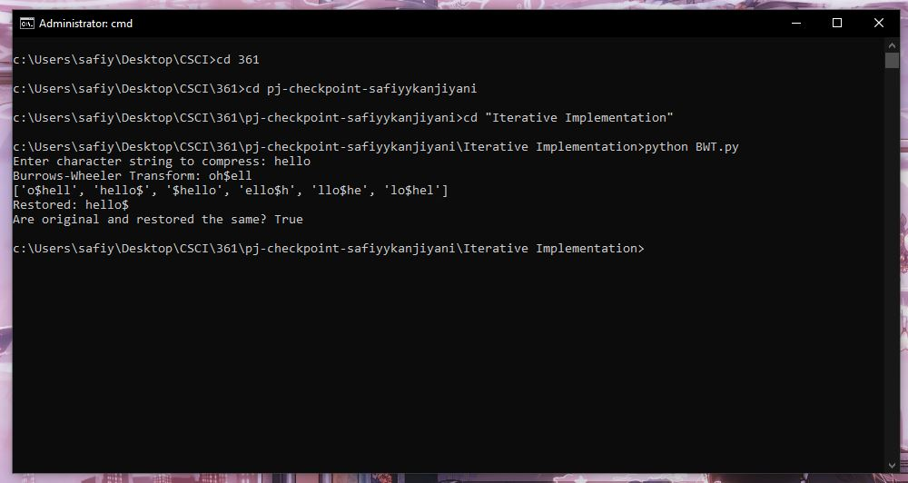

## Burrows Wheeler Transform Final Project

### Background:

This project presents a parallel implementation for the Burrows Wheeler Transform (BWT). We do this through using a divide and conquer strategy. The BWT is a lossless data compression method. My motivation for parallelizing the BWT was for the application using a GPU which could have many processors in parallel compressing discrete blocks of an image. Learning about it more, I found it is widely used in bioinformatics to compress sequences of DNA which could reach staggering file sizes. Other data compression methods such as bzip2, gzip, and zip are designed for sequential processing and are generally very fast, however the compression rates they achieve are worse. The alternatives like JPEG and MPEG have good compression ratios, however they aren't lossless, meaning they lose some of their data in decompression. Dealing with massive amounts of data, as in the case of DNA sequences, compression percentages are valued above time combined with being lossless. Despite this, there isn't too much scholarship dealing with the parallelization of the BWT and those that did applied very specifically to a dictionary dealing with genetics {A, G, C, T}

I primarily used the paper Parallel and Memory-efficient Burrows Wheeler Transform by Shinya Hayashi and Kenjiro Taura. I found the paper extremely technical and difficult to read. I tried my best to use the merging algorithm for blocks described int he paper, however the psuedocode wasn't so psuedo and the rest of the paper didn't really expand on it, only referencing it at times. I primarily figured it out using the figures showing the process and even then, I don't know if it's accurate. Now, onto the program!

### My Program:

I made an iterative version of the BWT in python which can be run by ```python BWT.py```. It's extremely simple and only served to make me more familiar with the BWT.


The BWT works in a few simple steps:
1. create an array of length(str)
2. add a unique rotation of str to each index of the array
3. sort the array by the strings in alphabetical order
4. take the last character of each string in the sorted order.
5. this is your BWT

I thought of how to parallelize this without the consultation of any academic sources and I came up that you can do step 2, which is rotating each string, and step 3, which is sorting the array, in parallel. I wrote up a naive implementation of parallelization in go which can be ran by ```go run naiveBWT.go```.

After this I consulted the sources that I thought would be useful during literature review. One dealt with parallelizing using a field programmable gate array (FPGA), which I realized was way out of my league. Another two dealt with the parallelization using a specific genetic dictionary. The best source I could find was the paper by Shinya Hayashi and Kenjiro Taura.


The process outlined by the paper:
1. split the string into smaller strings until they reach a minimum size
2. compute the BWT for them independently in parallel
3. merge them using the merging algorithm.

I was able to easily write up  a parallel computation for the BWT using go however deciphering the merging algorithm was a headache. I eventually managed to come up with a somewhat working implementation which can be run by ```go run BWT.go```. However the program is, in all honestly, a bit janky. It computes the suffix array in parallel for the merging algorithm, however it doesn't have a deterministic answer for some reason, so sometimes it gives the right answer and sometimes not.


The outline of the program works this way:
1. it asks a user a string to compress
2. it then splits the string by n processors (default 2, more on this later)
3. it then computes the suffix array and the individual bwt for each substring
4. using the suffix array, it determines where each character in the bwt should go in the finished bwt
5. it then merges them and compares it to the result of a linear bwt

Overall, I'd say I'm proud of how it turned out for how difficult research review and how sparse the literature was in this subject. Discussion of improvement will be in a later section. Now onto problems!

### Errors and Bugs:
The first problem is that the parallel suffix array sometimes doesn't give the correct solution which is likely due to some error in goroutine which makes one process finish before the others, so sometimes to get the right answer for the bwt requires multiple attempts.

When I was making the program, I only tried with processors = 2, so the entire program is based around combining two substrings. I didn't have time but if there were (for example) 3 processors, it would merge the first 2, then combine the result of that with the third. However, currently, it tries to merge all three at the same time which DOES not produce the right result.

### Improvements and Direction:

If I had more time (like if it was a semester long project or thesis), I would fix the suffix array program by figuring out what's wrong with the parallelization or just revert to an iterative approach. I would then fix the processor problem by merging substrings two at a time.

After all this, I would likely clean up my data structures, because there are a lot. After that, if I'm satisfied, I'd compare compression time to my iterative approach on a long string, then more broadly to other compression algorithm. 
